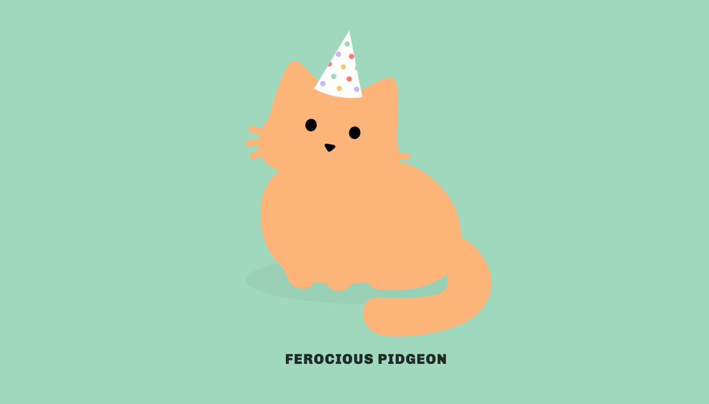
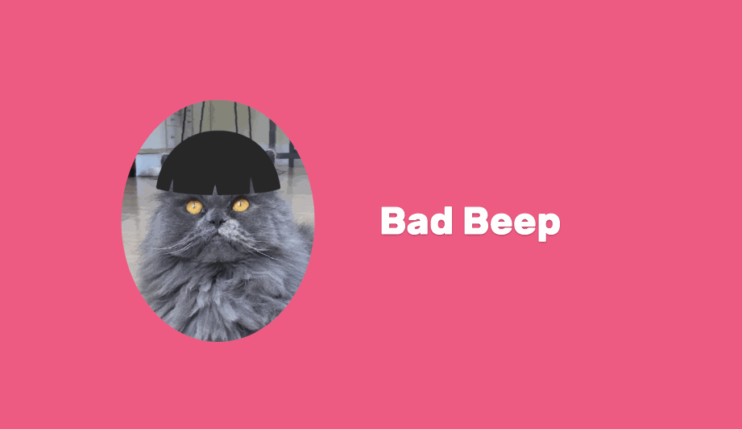
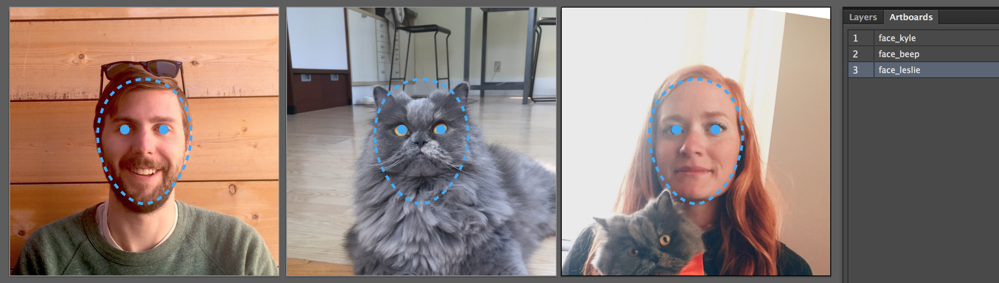
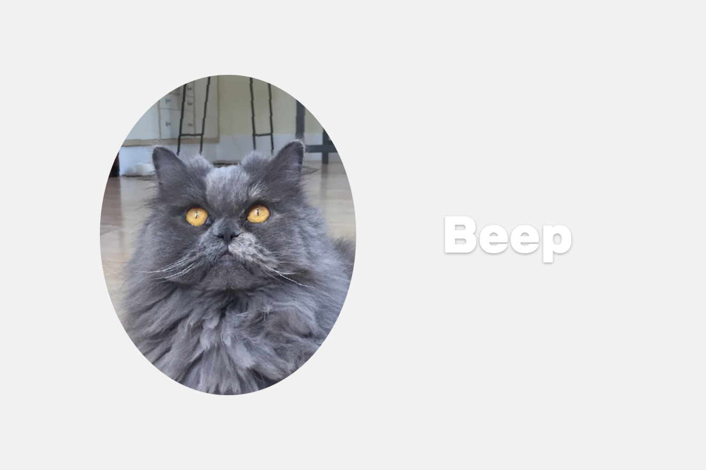
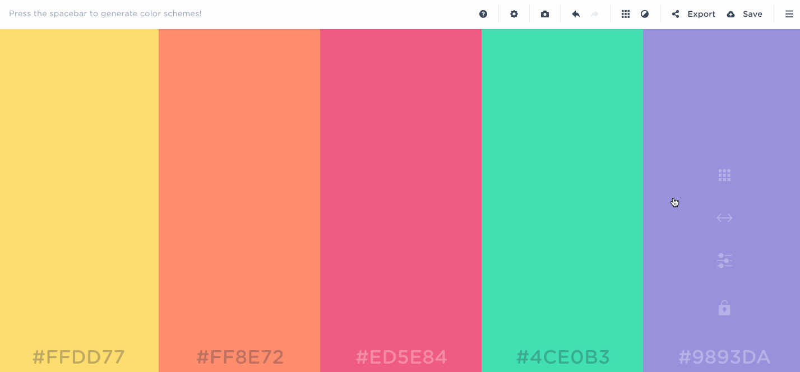
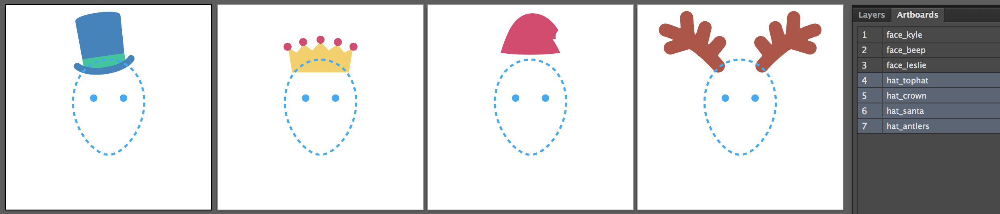
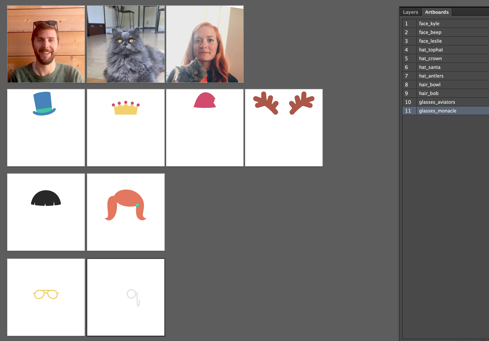
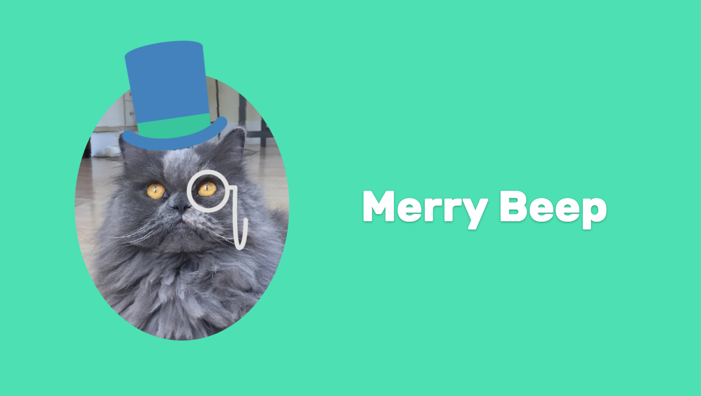

# How to make a Chrome extension to delight (or troll) your friends

If you're like me, you grew up drawing mustaches on celebrities. Every photograph was subject to your doodling wrath, and your brilliance was taken to a whole new level with computer programs like Microsoft Paint. The advent of digital cameras meant that no one was safe from your handiwork, especially not your friends. And when you finally got your hands on Photoshop, you spent hours maniacally giggling at your artistic genius. 

But today is different. You're a serious adult with important things to do and a reputation to uphold. You keep up with modern web techniques and trends, and have little time for fun other than a random Giphy on Slack... right? 

**Nope.** 

If there's one thing 2016 has taught me, it's that we—the self-serious, world-changing tech movers and shakers of the universe—haven't changed one bit from our younger, more delightable selves.

How do I know? This year I created a Chrome extension called [Tabby Cat](https://chrome.google.com/webstore/detail/tabby-cat/mefhakmgclhhfbdadeojlkbllmecialg) and watched hundreds of thousands of people ditch productivity for randomly generated cats. Tabby Cat replaces your new tab page with an SVG cat featuring a silly name like "Stinky Dinosaur" or "Tiny Potato". Over time, the cats collect goodies that vary in absurdity from fishbones to lawn flamingos to Raybans. Kids and adults alike use this extension, and analytics show the majority of use happens Monday through Friday from 9-5. The popularity of Tabby Cat has convinced me there's still plenty of room in our big, grown-up hearts for fun.

[](https://chrome.google.com/webstore/detail/tabby-cat/mefhakmgclhhfbdadeojlkbllmecialg)

Today, we’re going to combine the formula behind Tabby Cat with your intrinsic desire to delight (or troll) your friends, and create a web app that generates your friends with random objects and environments of your choosing. You can publish it as a Chrome extension to replace your new tab, or simply host it as a website and point to it with the [New Tab Redirect](https://chrome.google.com/webstore/detail/new-tab-redirect/icpgjfneehieebagbmdbhnlpiopdcmna?hl=en) extension. 

Here's a sneak peek at my final result featuring my partner, my cat, and I in cheerfully weird accessories. Your result will look however you want it to.



Along the way, we'll cover how to build a Chrome extension that replaces the new tab page, and explore ways to program randomness into your work to create something truly delightful. 

**What you'll need**
- Adobe Illustrator (or a similar illustration program to export PNG)
- Some images of your friends
- A text editor

_Note: This can be as simple or as complex as you want it to be. Most of the application is pre-built so you can focus on kicking back and getting in touch with your creative side. If you want to dive in deeper, you'll find ways to do it._

## Getting started

1. Download a local copy of the boilerplate for today's tutorial [here](https://github.com/lzacharkow/Friendville), and open it in a text editor. Inside, you'll find a simple web app that you can run in Chrome. 
2. Open `index.html` in Chrome. You should see a grey page that says "Noname".
3. Open `template.pdf` in Adobe Illustrator or a similar program that can export PNG. The file contains an artboard measuring 800px x 800px, with a dotted blue outline of a face. This is your template.

Note: We're using Google Chrome to build and preview this application because the end-result is a Chrome extension. This means that the application isn't totally cross-browser compatible, but that's okay.

## Step 1: Gather your friends
The first thing to do is choose who your muses are. Since the holidays are upon us, I'd suggest finding inspiration in your family.

#### Create your artwork
For each person, find an image where their face is pointed as forward as possible. Place the image onto the `Artwork` layer of the Illustrator file, and line up their face with the template. Then, rename the artboard something descriptive like `face_bob`. Here's my crew:


_As you can see, my use of the word "family" extends to cats. There's no judgement here._

Notice that some of my photos don't completely fill the artboard–that's fine. The images will be clipped into ovals when they're rendered in the application.

Now, export your images by following these steps:

1. Turn the `Template` layer off and export the images as PNGs. 
2. In the Export dialog, tick the "Use Artboards" checkbox and enter the range with your faces. 
3. Export at 72ppi to keep things running fast. 
4. Save your images into the `images/` folder in your project.

#### Add your images to config.js
Open `scripts/config.js`. This is where you configure your extension. 

Add key value pairs to the `faces` object. The key should be the person's name, and the value should be the filepath to the image.

```js
faces: {
	leslie: 'images/face_leslie.png',
	kyle: 'images/face_kyle.png',
	beep: 'images/face_beep.png'
}
```

The application will choose one of these options at random each time you open a new tab. This pattern is used for everything in the config file. You give the application groups of choices, and it chooses one at random each time it loads. The only thing that's special about the `faces` object is that person's name will also be displayed when their face is chosen.

Now, when you refresh the project in Chrome, you should see one of your friends along with their name, like this:



Congrats, you're off and running!

## Step 2: Add adjectives
Now that you've loaded your friends into the application, it's time to call them names. This step definitely yields the most laughs for the least amount of effort.

Add a list of adjectives into the `prefixes` array in `config.js`. To get the words flowing, I took inspiration from ways I might describe some of my relatives during a holiday gathering...

```js
prefixes: [
	'Loving',
	'Drunk',
	'Chatty',
	'Merry',
	'Creepy',
	'Introspective',
	'Cheerful',
	'Awkward',
	'Unrelatable',
	'Hungry',
	...
]
```

When you refresh Chrome, you should see one of these words prefixed before your friend's name. Voila!


## Step 3: Choose your color palette
Real talk: I'm bad at choosing color palettes, so I have a trick up my sleeve that I want to share with you. If you've been blessed with the gift of color aptitude, skip ahead.

#### How to choose colors
To create a color palette, I start by going to a [Coolors.co](https://coolors.co/), and I hit the spacebar until I find a palette that I like. We need a wide gamut of hues for our palette, so lock down colors you like and keep hitting the spacebar until you find a nice, full range. You can use as many or as few colors as you like.

Copy these colors into your swatches in Adobe Illustrator. They'll be the base for any illustrations you create later.

Now you need a set of background colors. Here's my trick to making these consistent with your illustration palette without completely blending in. Use the "Adjust Palette" tool in Coolors to dial up the brightness a few notches, and the saturation down just a tad to remove any neon effect. These will be your background colors.



#### Add your background colors to config.js 
Copy your hex codes into the `bgColors` array in `config.js`.

```js
bgColors: [
	'#FFDD77',
	'#FF8E72',
	'#ED5E84',
	'#4CE0B3',
	'#9893DA',
	...
]
```

Now when you go back to Chrome and refresh the page, you'll see your new palette!


## Step 4: Accessorize
This is the fun part. We're going to illustrate objects, accessories, lizards—whatever you want—and layer them on top of your friends.

Your objects will be categorized into groups, and one option from each group will be randomly chosen each time you load the page. Think of a group like "hats" or "glasses". This will allow combinations of accessories to show at once, without showing two of the same type on the same person.

#### Create a group of accessories
To get started, open up Illustrator and create a new artboard out of the template. Think of a group of objects that you can riff on. I found hats to be a good place to start. If you don't feel like illustrating, you can use cut-out images instead.



Next, follow the same steps as you did when you exported the faces. Here they are again:

1. Turn the `Template` layer off and export the images as PNGs. 
2. In the Export dialog, tick the "Use Artboards" checkbox and enter the range with your hats. 
3. Export at 72ppi to keep things running fast. 
4. Save your images into the `images/` folder in your project.

#### Add your accessories to config.js
In `config.js`, add a new key to the `customProps` object that describes the group of accessories that you just created. Its value should be an array of the filepaths to your images. This is my hats array:

```js
customProps: {
	hats: [		
		'images/hat_crown.png',
		'images/hat_santa.png',
		'images/hat_tophat.png',
		'images/hat_antlers.png'
	]
}
```

Refresh Chrome and behold, accessories!


#### Create as many more accessories as you want
Repeat the steps above to create as many groups of accessories as you want. I went on to make glasses and hairstyles, so my final illustrator file looks like this:



The last step is adding your new groups to the config object. List your groups in the order that you want them to be stacked in the DOM. My final output will be hair, then hats, then glasses:

```js
customProps: {
	hair: [		
		'images/hair_bowl.png',
		'images/hair_bob.png'
	],	
	hats: [		
		'images/hat_crown.png',
		'images/hat_santa.png',
		'images/hat_tophat.png',
		'images/hat_antlers.png'
	],
	glasses: [
		'images/glasses_aviators.png',
		'images/glasses_monacle.png'
	]
}
```

And, there you have it! Randomly generated friends with random accessories. 



Feel free to go much crazier than I did. I considered adding a whole group of animals in celebration of the new season of Planet Earth, or even adding Sir Attenborough himself, or doing a bit of role reversal and featuring the animals with little safari hats! But I digress...

## Step 5: Publish it
It's time to put this in your new tabs! You have two options:

1. Publish it as a Chrome extension in the Chrome Web Store.
2. Host it as a website and point to it with the [New Tab Redirect](https://chrome.google.com/webstore/detail/new-tab-redirect/icpgjfneehieebagbmdbhnlpiopdcmna?hl=en) extension.

Today, we're going to cover Option #1 because I want to show you how to make the simplest Chrome extension possible. However, I recommend Option #2 if you want to keep your project private. Every Chrome extension that you publish is made publicly available, so unless your friends want their faces published to an extension that anyone can use, I'd suggest sticking to Option #2.

#### How to make a simple Chrome extension to replace the new tab page
All you need to do to make your project into a Chrome extension is add a `manifest.json` file to the root of your project with the following contents. There are [plenty of other properties](https://developer.chrome.com/extensions/manifest) that you can add to your manifest file, but these are the only ones that are required for a new tab replacement:

```js
{
 	"manifest_version": 2,
 	"name": "Your extension name",
 	"version": "1.0",
  	"chrome_url_overrides" : {
    	"newtab": "index.html"
  	}
}
```

To test your extension, you'll need to run it in Developer Mode. Here's how to do that:

1. Go to the Extensions page in Chrome by navigating to `chrome://extensions/`.
2. Tick the checkbox in the upper-right corner labelled "Developer Mode".
3. Click "Load unpacked extension..." and select this project.
4. If everything is running smoothly, you should see your project when you open a new tab. If there are any errors, they should appear in a yellow box on the Extensions page.

Voila! Like I said, this is a _very_ light example of a Chrome extension, but Google has tons of great [documentation](https://developer.chrome.com/extensions) on how to take things further. Check it out and see what inspires you.

## Share the love
Now that you know how to make a new tab extension, go forth and create! But wield your power responsibly. New tabs are opened so often that they've become a part of everyday life–just consider how many tabs you opened today. Some people prefer to-do lists in their tabs, and others prefer cats. 

At the end of the day, let's make something that makes us happy. Cheers!
